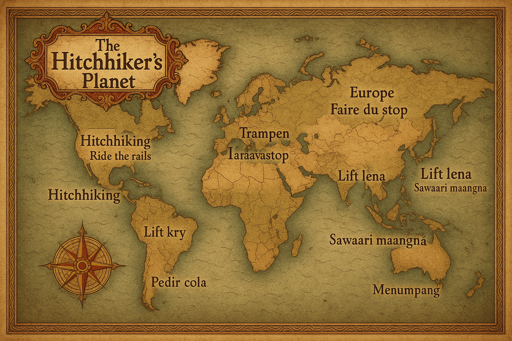

<!-- Improved compatibility of back to top link: See: https://github.com/rayanthoney/ram_uber_app/pull/73 -->

<a id="readme-top"></a>

<!-- WELCOME -->

<div align="center">
   <a href="https://github.com/rayanthoney/react-nativeRyde.git">
    
  </a>

  <h2 align="center">Welcome to your Expo app 👋</h2>

   <p align="center">
    <h3>An Uber Clone app with Payments | PostgreSQL, TypeScript, Stripe, Tailwind.</h3>
    <br />
    <a href="https://github.com/rayanthoney/react-nativeRyde.git"><strong>Explore the docs »</strong></a>
    <br />
    <br />
    <a href="https://github.com/rayanthoney/Repository-Name">View Demo</a>
    &middot;
    <a href="https://github.com/rayanthoney/react-nativeRyde.git/issues/new?labels=bug&template=bug-report---.md">Report Bug</a>
    &middot;
    <a href="https://github.com/rayanthoney/react-nativeRyde.git/issues/new?labels=enhancement&template=feature-request---.md">Request Feature</a>
  </p>
</div>

<!-- TABLE OF CONTENTS -->
<details>
  <summary>Table of Contents:</summary>
  <ol>
    <li>
      <a href="#about-the-project">About The Project</a>
      <ul>
        <li><a href="#built-with">Built With</a></li>
      </ul>
    </li>
    <li>
      <a href="#getting-started">Getting Started</a>
      <ul>
        <li><a href="#prerequisites">Prerequisites</a></li>
        <li><a href="#installation">Installation</a></li>
      </ul>
    </li>
    <li><a href="#usage">Usage</a></li>
    <li><a href="#roadmap">Roadmap</a></li>
    <!-- <li><a href="#contributing">Contributing</a></li> -->
    <li><a href="#license">License</a></li>
    <li><a href="#contact">Contact</a></li>
    <!-- <li><a href="#acknowledgments">Acknowledgments</a></li> -->
  </ol>
</details>
<br>

<!-- ABOUT THE PROJECT -->
# About The Project

<div align="center" >
<!-- link to project -->
    <a href='-URL TO DEMO GOES HERE-'>
    <!-- link to local image -->
        
    </a>
</div>

<br>

<!-- BUILT WITH -->
## Built With

### Tech Stack

- React Native
- Expo
- Stripe
- PostgreSQL
- Google Maps
- zustand
- Clerk
- Tailwind CSS

<br>

[![React Native][React_Native]][React_Native-url]
[![Expo][Expo]][Expo-url]
[![TypeScript][TypeScript]][TypeScript-url]
[![TailWind CSS][Tailwind]][TailWind-url]
[![Postgresql][Postgresql]][Postgresql-url]
[![Stripe][Stripe]][Stripe-url]
[![Clerk][Clerk]][Clerk-url]
[![Google-Maps][Google-Maps]][Google-Maps-url]
[![Zustand][Zustand]][Zustand-url]

<br>

<!-- MARKDOWN LINKS & IMAGES -->
<!-- https://www.markdownguide.org/basic-syntax/#reference-style-links -->
[React_Native]: https://img.shields.io/badge/-React_Native-black?style=for-the-badge&logoColor=white&logo=react&color=61DAFB
[React_Native-url]: https://example.com/
[Expo]: https://img.shields.io/badge/-Expo-black?style=for-the-badge&logoColor=white&logo=expo&color=000020
[Expo-url]: https://example.com/
[TypeScript]: https://img.shields.io/badge/-TypeScript-black?style=for-the-badge&logoColor=white&logo=typescript&color=3178C6
[TypeScript-url]: https://example.com/
[TailWind]: https://img.shields.io/badge/-Nativewind-black?style=for-the-badge&logoColor=white&logo=tailwindcss&color=06B6D4
[TailWind-url]: https://example.com/
[Postgresql]: https://img.shields.io/badge/-PostGreSQL-black?style=for-the-badge&logoColor=white&logo=postgresql&color=4169e1
[Postgresql-url]: https://example.com/
[Stripe]: https://img.shields.io/badge/-Stripe-black?style=for-the-badge&logoColor=white&logo=stripe&color=6860ff
[Stripe-url]: https://example.com/
[Clerk]: https://img.shields.io/badge/-Clerk-black?style=for-the-badge&logoColor=white&logo=clerk&color=787984
[Clerk-url]: https://example.com/
[Google-Maps]: https://img.shields.io/badge/-Google_Maps-black?style=for-the-badge&logoColor=white&logo=google&color=34A853
[Google-Maps-url]: https://example.com/
[Zustand]: https://img.shields.io/badge/-Zustand-black?style=for-the-badge&logoColor=white&logo=zustand&color=a24f73
[Zustand-url]: https://example.com/

<p align="right">(<a href="#readme-top">back to top</a>)</p>
<br>

<!-- GETTING STARTED -->
## Getting Started

This is an [Expo](https://expo.dev) project created with [`create-expo-app`](https://www.npmjs.com/package/create-expo-app).

<br>
Built with React Native for handling the user interface, Google Maps for rendering maps with directions, stripe for handling payments, serverless Postgres for managing databases, and styled with TailwindCSS, Uber Clone is a perfect mobile app. The primary goal is to demonstrate how to develop full-stack mobile applications to showcase the developer's skills in a unique manner that creates a lasting impact.

<!-- PREREQUISITES -->
## Prerequisites

Make sure you have the following installed on your machine:

- [Git](https://git-scm.com/)
- [Node.js](https://nodejs.org/en)
- [npm](https://www.npmjs.com/) (Node Package Manager)

**Cloning the Repository**

```bash
git clone https://github.com/rayanthoney/react-nativeRyde.git
cd uber
```

<!-- INSTALLATION -->
## Installation

1. Install dependencies

   ```bash
   npm install
   ```

2. Start the app

   ```bash
   npx expo start
   ```

In the output, you'll find options to open the app in a

- [development build](https://docs.expo.dev/develop/development-builds/introduction/)
- [Android emulator](https://docs.expo.dev/workflow/android-studio-emulator/)
- [iOS simulator](https://docs.expo.dev/workflow/ios-simulator/)
- [Expo Go](https://expo.dev/go), a limited sandbox for trying out app development with Expo

You can start developing by editing the files inside the **app** directory. This project uses [file-based routing](https://docs.expo.dev/router/introduction).

<!-- FRESH PROJECT -->
### Get a fresh project

When you're ready, run:

```bash
npm run reset-project
```

This command will move the starter code to the **app-example** directory and create a blank **app** directory where you can start developing.

<!-- LEARN MORE -->
### Learn more

To learn more about developing your project with Expo, look at the following resources:

- [Expo documentation](https://docs.expo.dev/): Learn fundamentals, or go into advanced topics with our [guides](https://docs.expo.dev/guides).
- [Learn Expo tutorial](https://docs.expo.dev/tutorial/introduction/): Follow a step-by-step tutorial where you'll create a project that runs on Android, iOS, and the web.


<p align="right">(<a href="#readme-top">back to top</a>)</p>

<!-- USAGE -->
## Usage

Use this space to show useful examples of how a project can be used. Additional screenshots, code examples and demos work well in this space. You may also link to more resources.

_For more examples, please refer to the [Documentation](https://example.com)_

<!-- ROADMAP -->
## Roadmap

- [x] Add Changelog
- [x] Add back to top links
- [ ] Add Additional Templates w/ Examples
- [ ] Add "components" document to easily copy & paste sections of the readme
- [ ] Multi-language Support
    - [ ] Chinese
    - [ ] Spanish

See the [open issues](https://github.com/othneildrew/Best-README-Template/issues) for a full list of proposed features (and known issues).

<!-- LICENSE -->
## License

Distributed under the Unlicense License. See `LICENSE.txt` for more information.

<!-- CONTACT -->
## Contact

Ray Anthoney - [@rayanthoney](https://twitter.com/@rayanthoney) - email@example.com

Project Link: [https://github.com/rayanthoney/react-nativeRyde](https://github.com/rayanthoney/react-nativeRyde)

<p align="right">(<a href="#readme-top">back to top</a>)</p>